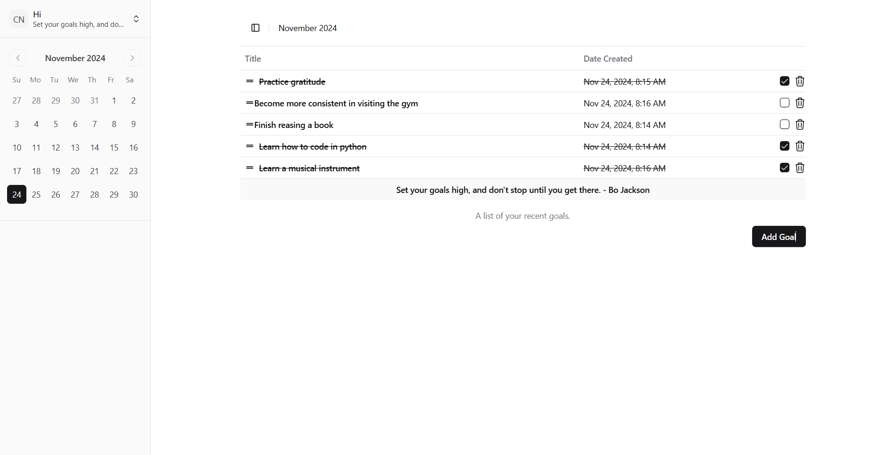
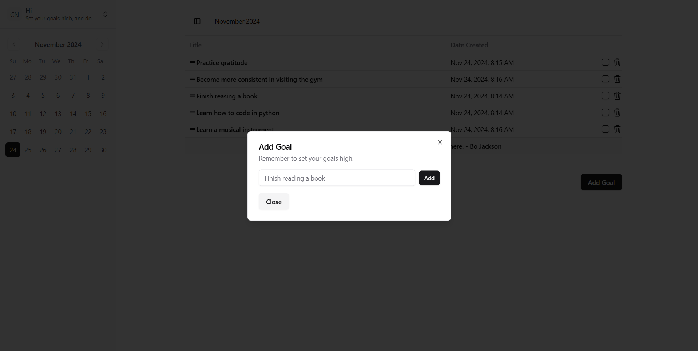
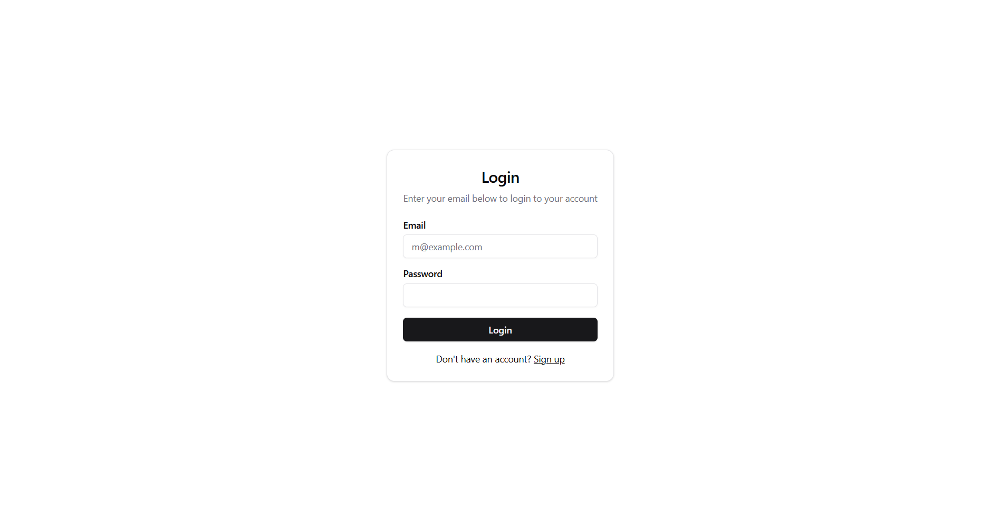

# **Fusion - Productivity App**

A feature-rich productivity app designed to help users organize tasks, track goals, and enhance efficiency. Built with a modern tech stack and a clean, scalable architecture.

---

## **Screenshots**

### **1. Landing Page**

_Description: A clean and intuitive landing page._


### **1. Dashboard Page**

_Description: Displays the list of tasks with drag-and-drop functionality._



### **2. Task Management**

_Description: Add, delete, and reorder tasks._



### **3. Authentication**

_Description: User login and registration screens._



---

## **Features**

- Task creation, deletion, and completion tracking
- Drag-and-drop task reordering
- Authentication (login/register)
- Responsive UI
- Backend API for managing tasks and users
- Unit and integration tests

---

## **Tech Stack**

**Frontend:**

- React
- TypeScript
- Tailwind CSS (via ShadCN)
- Vite

**Backend:**

- Node.js
- Express
- TypeORM
- MySQL

**Testing:**

- Jest
- React Testing Library
- MSW (Mock Service Worker)

---

## **Project Structure**

### **Frontend**

```
frontend/
├── src/
│   ├── components/       # Reusable UI components
│   ├── hooks/            # Custom React hooks
│   ├── pages/            # Page-level components (e.g., Dashboard)
│   ├── services/         # API service logic
│   ├── mocks/            # Mock data and MSW handlers for testing
│   ├── styles/           # Tailwind CSS customizations
│   └── tests/            # Unit and integration tests
├── public/               # Static assets
├── jest.config.ts        # Jest configuration
├── vite.config.ts        # Vite configuration
└── tsconfig.json         # TypeScript configuration
```

### **Backend**

```
backend/
├── src/
│   ├── controllers/      # Request handlers for API routes
│   ├── db/               # Database configuration and migrations
│   ├── entities/         # TypeORM entity definitions
│   ├── middlewares/      # Express middleware functions
│   ├── routes/           # API route definitions
│   ├── services/         # Business logic and database operations
│   ├── utils/            # Utility functions
│   └── tests/            # Unit tests for services and routes
├── .env                  # Environment variables
├── jest.config.ts        # Jest configuration
└── tsconfig.json         # TypeScript configuration
```

---

## **Setup Instructions**

### **Cloning the Repository**

Since the repository uses submodules, you need to initialize and clone them as well:

```bash
git clone --recurse-submodules https://github.com/joecode77/fusion.git

```

If you’ve already cloned the repository without submodules, initialize and update them manually:

```bash
git submodule update --init --recursive

```

### **Frontend Setup**

1. Navigate to the `frontend` folder:

   ```bash
   cd frontend
   ```

2. Install dependencies:

   ```bash
   npm install
   ```

3. Start the development server:

   ```bash
   npm run dev
   ```

4. Open the app in your browser:
   ```
   http://localhost:5173
   ```

### **Backend Setup**

1. Navigate to the `backend` folder:

   ```bash
   cd backend
   ```

2. Install dependencies:

   ```bash
   npm install
   ```

3. Create a `.env` file:

   ```plaintext
   DB_HOST=localhost
   DB_USERNAME=root
   DB_PASSWORD=password
   DB_NAME=productivity_db
   PORT=8000
   SECRET_KEY=your-secret-key
   ```

4. Start the backend server:
   ```bash
   npm run dev
   ```

---

## **Design Decisions**

### **Frontend:**

- **Component-Based Architecture**:
  - Reusable components (e.g., `Table`, `Checkbox`) to ensure consistency and faster development.
- **TypeScript**:
  - Provides strong typing, catching errors during development and improving maintainability.
- **Drag-and-Drop**:
  - Implemented using `@dnd-kit` for an accessible and customizable experience.
- **ShadCN + Tailwind CSS**:
  - Ensures responsive design with a modern, minimal UI.

### **Backend:**

- **TypeORM**:
  - Simplifies database operations and enforces schema validation.
- **Service Layer**:
  - Business logic is separated from controllers, adhering to Single Responsibility Principle (SRP).
- **Modular Routes**:
  - Organized by feature for easier scalability.

### **Testing**:

- **Jest and React Testing Library**:
  - Comprehensive unit and integration tests ensure code reliability.
- **MSW**:
  - Enables realistic API mocking for frontend tests without requiring a live server.

---

Feel free to reach out if you have any questions or need assistance with the setup!
